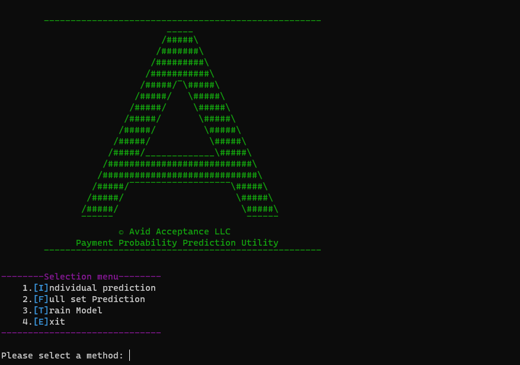
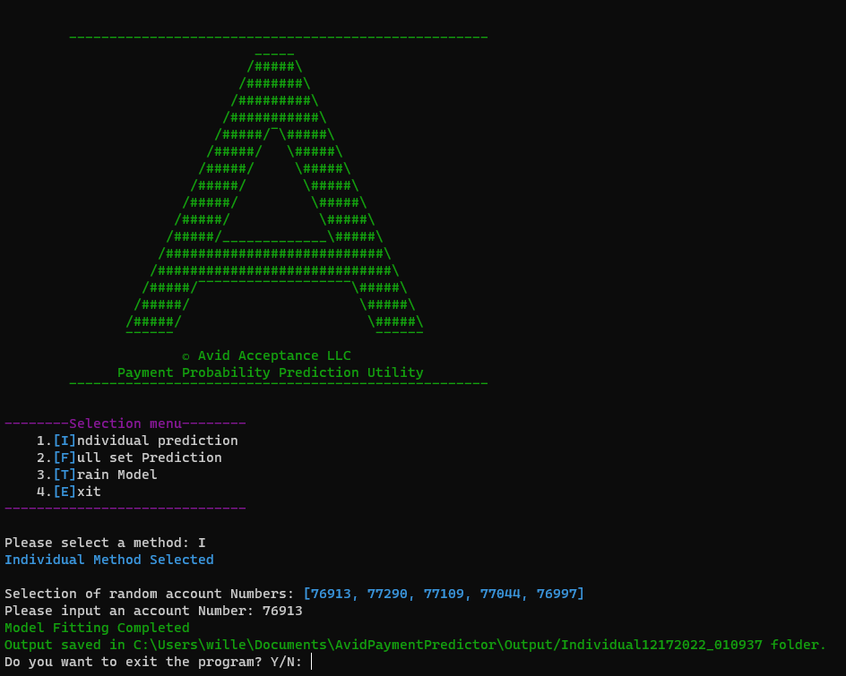
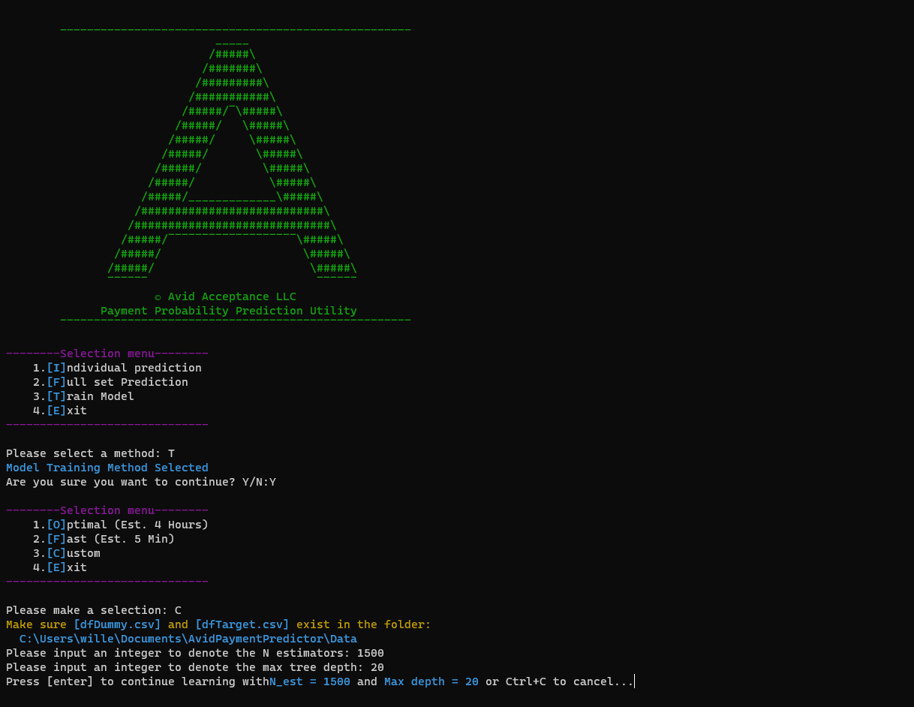
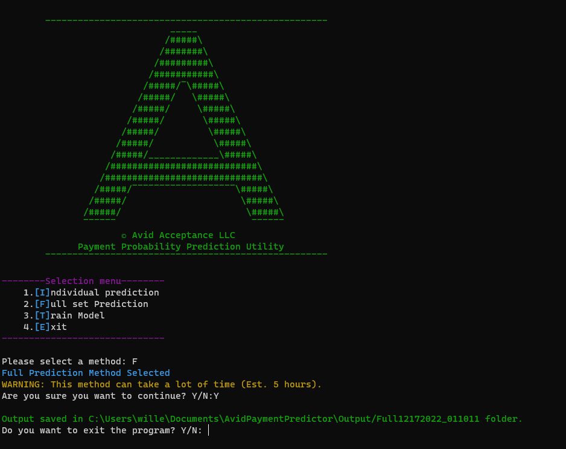
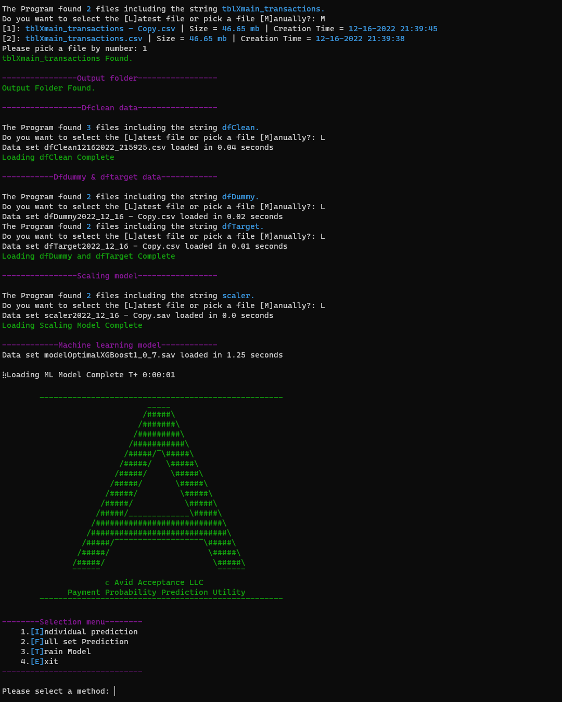
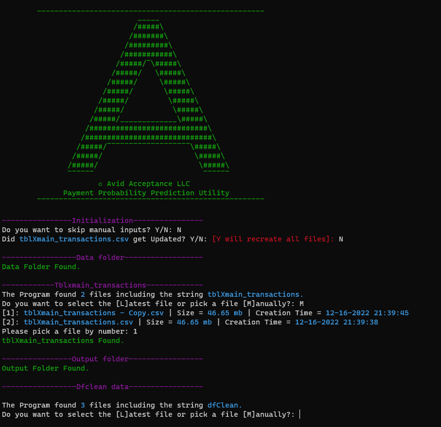
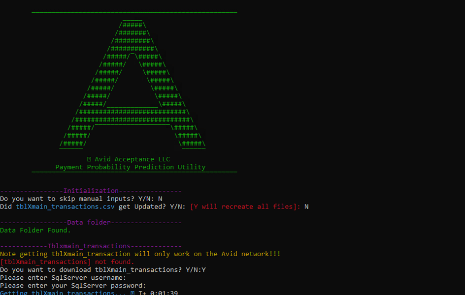
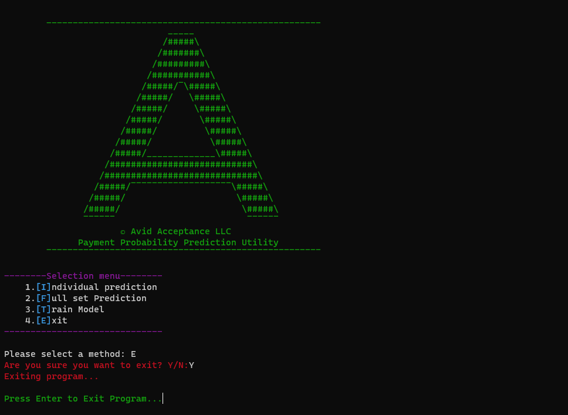

# Payment Predictor Utility 2.0

An all in one solution for employing XGboost machine learning to predict customer's probability of payment.

# VERSION INFO
1. Python=3.10
2. colorama=0.4.6
3. pandas=1.5.2
4. scikit-learn=1.1.3
5. numpy=1.23.4
6. seaborn=0.12.1
7. xgboost=1.7.2
8. ipython=8.6.0
9. tabulate=0.8.10
10. pyodbc=4.0.35

_Note: Use latest viable requirements for versions above_

# File Requirements
A proprietary file called _tblXmain_transactions.csv_ is needed to run the program.

The setup will guide you through file placement.

# ScreenShots

<h4>Main Screen</h4>

<h4>Individual Prediction</h4>

<h4>Model Training</h4>

<h4>Full Set Prediction</h4>

<h4>Debug Mode</h4>

<h4>File Selector</h4>

<h4>Retrieve Table from Sql</h4>

<h4>Exit Option</h4>

# License
Copyright (C) Willem van der Schans - All Rights Reserved.

THE CONTENTS OF THIS PROJECT ARE PROPRIETARY AND CONFIDENTIAL.
UNAUTHORIZED COPYING, TRANSFERRING OR REPRODUCTION OF THE CONTENTS OF THIS PROJECT, VIA ANY MEDIUM IS STRICTLY PROHIBITED.

The receipt or possession of the source code and/or any parts thereof does not convey or imply any right to use them
for any purpose other than the purpose for which they were provided to you.

The software is provided "AS IS", without warranty of any kind, express or implied, including but not limited to
the warranties of merchantability, fitness for a particular purpose and non infringement.
In no event shall the authors or copyright holders be liable for any claim, damages or other liability,
whether in an action of contract, tort or otherwise, arising from, out of or in connection with the software
or the use or other dealings in the software.

The above copyright notice and this permission notice shall be included in all copies or substantial portions of the Software.
